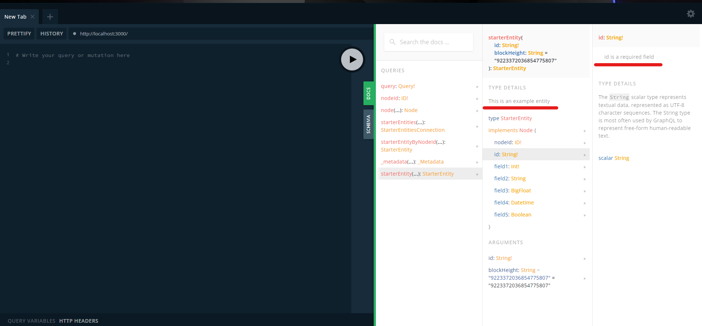

# GraphQL Schema

## Defining Entities

The `schema.graphql` file defines the various GraphQL schemas. Due to the way that the GraphQL query language works, the schema file essentially dictates the shape of your data from SubQuery. To learn more about how to write in GraphQL schema language, we recommend checking out [Schemas and Types](https://graphql.org/learn/schema/#type-language).

::: warning Important
When you make any changes to the schema file, don't forget to regenerate your types directory.
:::

::: code-tabs
@tab:active yarn

```shell
yarn codegen
```

@tab npm

```shell
npm run-script codegen
```

:::

All entites can be imported from the following directory after codegen:

```ts
import { GraphQLEntity1, GraphQLEntity2 } from "../types";
```

### Entities

Each entity must define its required fields `id` with the type of `ID!`. It is used as the primary key and unique among all entities of the same type.

Non-nullable fields in the entity are indicated by `!`. Please see the example below:

```graphql
type Example @entity {
  id: ID! # id field is always required and must look like this
  name: String! # This is a required field
  address: String # This is an optional field
}
```
### Adding Documentation Strings to GraphQL Schema

Documentation strings (also known as "doc strings") can be added to a GraphQL schema to provide human-readable descriptions of the schema's types and fields. This can be particularly useful for maintaining and understanding the schema over time, and for auto-generating API documentation.

Doc strings are added as comments to the schema, using triple-quote syntax ("""). They must appear before the type or field definition that they describe.

Here's an example of a schema with doc strings:

```graphql
"""This is an example entity"""
type StarterEntity @entity {
  """id is a required field"""
  id: ID!

  field1: Int!

  # The following field is optional
  field2: String

  field3: BigInt
  field4: Date
  field5: Boolean
}

```

In addition, when using GraphQL query Playground, these doc strings will automatically show up in the schema documentation panel. This makes it easier for developers to understand your API while exploring it, and can even serve as a form of live, interactive documentation for your API.



### Naming Constraints

You'll need to shorten the entity's name if you get an error such as the following when running the app:

```shell
subquery-notifications-postgres-1        | 2022-08-26 14:18:12.355 UTC [1922] ERROR:  constraint "bank_msg_multi_send_input_coins_bank_msg_multi_send_input_id_fk" for table "bank_msg_multi_send_input_coins" does not exist
subquery-notifications-postgres-1        | 2022-08-26 14:18:12.355 UTC [1922] STATEMENT:  COMMENT ON CONSTRAINT bank_msg_multi_send_input_coins_bank_msg_multi_send_input_id_fkey ON "app"."bank_msg_multi_send_input_coins" IS E'@foreignFieldName coins'
```

Subquery automatically generates Postgres identifiers for your entities. For example, if you have an entity named `BankMsgMultiSendInputCoins`, then an identifier `bank_msg_multi_send_input_coins_bank_msg_multi_send_input_id_fkey` will be automatically generated in Postgres. However, this identifier is 65 bytes, and Postgres doesn't support identifiers larger than 63 bytes. In this example, shortening the entity's name to `BankMultiSendInputCoins` will resolve the issue.

### Supported scalars and types

We currently support the following scalar types:

- `ID`
- `Int`
- `String`
- `BigInt`
- `Float`
- `Date`
- `Boolean`
- `<EntityName>` for nested relationship entities, you might use the defined entity's name as one of the fields. Please see in [Entity Relationships](graphql.md#entity-relationships).
- `JSON` can alternatively store structured data, please see [JSON type](graphql.md#json-type)
- `<EnumName>` types are a special kind of enumerated scalar that is restricted to a particular set of allowed values. Please see [Graphql Enum](https://graphql.org/learn/schema/#enumeration-types)

## Indexing by non-primary-key field

To improve query performance, index an entity field simply by implementing the `@index` annotation on a non-primary-key field.

However, we don't allow users to add `@index` annotation on any [JSON](graphql.md#json-type) object. By default, indexes are automatically added to foreign keys and for JSON fields in the database, but only to enhance query service performance.

Here is an example.

```graphql
type User @entity {
  id: ID!
  name: String! @index(unique: true) # unique can be set to true or false
  title: Title! # Indexes are automatically added to foreign key field
}

type Title @entity {
  id: ID!
  name: String! @index(unique: true)
}
```

Assuming we knew this user's name, but we don't know the exact id value, rather than extract all users and then filtering by name we can add `@index` behind the name field. This makes querying much faster and we can additionally pass the `unique: true` to ensure uniqueness.

**If a field is not unique, the maximum result set size is 100**

When code generation is run, this will automatically create a `getByName` under the `User` model, and the foreign key field `title` will create a `getByTitleId` method,
which both can directly be accessed in the mapping function.

```sql
/* Prepare a record for title entity */
INSERT INTO titles (id, name) VALUES ('id_1', 'Captain')
```

```typescript
// Handler in mapping function
import { User } from "../types/models/User";
import { Title } from "../types/models/Title";

const jack = await User.getByName("Jack Sparrow");

const captainTitle = await Title.getByName("Captain");

const pirateLords = await User.getByTitleId(captainTitle.id); // List of all Captains
```

## Entity Relationships

An entity often has nested relationships with other entities. Setting the field value to another entity name will define a relationship between these two entities. Different entity relationships (one-to-one, one-to-many, and many-to-many) can be configured using the examples below.

Note that we always recommend enabling a reverse lookup on an entity to a related entity. To do this, attach `@derivedFrom` to the field and point to its reverse lookup field of another entity. This creates a virtual field on the entity that can be queried.

### One-to-One Relationships

One-to-one relationships are the default when only a single entity is mapped to another.

Example: A passport will only belong to one person and a person only has one passport (in this example):

```graphql
type Person @entity {
  id: ID!
}

type Passport @entity {
  id: ID!
  owner: Person!
}
```

or

```graphql
type Person @entity {
  id: ID!
  passport: Passport!
}

type Passport @entity {
  id: ID!
}
```

### One-to-Many relationships

You can use square brackets to indicate that a field type includes multiple entities.

Example: A person can have multiple accounts.

```graphql
type Person @entity {
  id: ID!
  accounts: [Account]! @derivedFrom(field: "person") #This is virtual field
}

type Account @entity {
  id: ID!
  person: Person!
}
```

### Many-to-Many relationships

A many-to-many relationship can be achieved by implementing a mapping entity to connect the other two entities.

Example: Each person is a part of multiple groups (PersonGroup) and groups have multiple different people (PersonGroup).

```graphql
type Person @entity {
  id: ID!
  name: String!
}

type PersonGroup @entity {
  id: ID!
  person: Person!
  Group: Group!
}

type Group @entity {
  id: ID!
  name: String!
}
```

Also, it is possible to create a connection of the same entity in multiple fields of the middle entity.

For example, an account can have multiple transfers, and each transfer has a source and destination account.

This will establish a bi-directional relationship between two Accounts (from and to) through Transfer table.

```graphql
type Account @entity {
  id: ID!
  publicAddress: String!
}

type Transfer @entity {
  id: ID!
  amount: BigInt
  from: Account!
  to: Account!
}
```

### Reverse Lookups

To enable a reverse lookup on an entity to a relation, attach `@derivedFrom` to the field and point to its reverse lookup field of another entity. This creates a virtual field on the entity that can be queried.

The Transfer "from" an Account is accessible from the Account entity by setting the sentTransfer or receivedTransfer as having their value derived from the respective from or to fields.

```graphql
type Account @entity {
  id: ID!
  publicAddress: String!
  sentTransfers: [Transfer] @derivedFrom(field: "from")
  receivedTransfers: [Transfer] @derivedFrom(field: "to")
}

type Transfer @entity {
  id: ID!
  amount: BigInt
  from: Account!
  to: Account!
}
```

## JSON type

We are supporting saving data as a JSON type, which is a fast way to store structured data. We'll automatically generate corresponding JSON interfaces for querying this data and save you time defining and managing entities.

We recommend users use the JSON type in the following scenarios:

- When storing structured data in a single field is more manageable than creating multiple separate entities.
- Saving arbitrary key/value user preferences (where the value can be boolean, textual, or numeric, and you don't want to have separate columns for different data types).
- The schema is volatile and changes frequently.

### Define JSON directive

Define the property as a JSON type by adding the `jsonField` annotation in the entity. This will automatically generate interfaces for all JSON objects in your project under `types/interfaces.ts`, and you can access them in your mapping function.

Unlike the entity, the jsonField directive object does not require any `id` field.
A JSON object is also able to nest with other JSON objects.

```graphql
type AddressDetail @jsonField {
  street: String!
  district: String!
}

type ContactCard @jsonField {
  phone: String!
  address: AddressDetail # Nested JSON
}

type User @entity {
  id: ID!
  contact: [ContactCard] # Store a list of JSON objects
}
```

### JSON field indexes

By default we automatically add indexes to JSON fields to improve querying performance. This can be disabled by specifying the `indexed: false` argument on the `jsonField` directive like so. This is useful if you are using alternative databases like Cockroach DB, as there can be some perfomance issues with inserting JSON data with an index (Cockroach does not support gin index and Jsonb data).

```graphql
type AddressDetail @jsonField(indexed: false) {
  street: String!
  district: String!
}
```

### Querying JSON fields

The drawback of using JSON types is a slight impact on query efficiency when filtering, as each time it performs a text search, it is on the entire entity.

However, the impact is still acceptable in our query service. Here is an example of how to use the `contains` operator in the GraphQL query on a JSON field to find the first 5 users who own a phone number that contains '0064'.

```graphql
#To find the the first 5 users own phone numbers contains '0064'.

query {
  user(first: 5, filter: { contactCard: { contains: [{ phone: "0064" }] } }) {
    nodes {
      id
      contactCard
    }
  }
}
```
