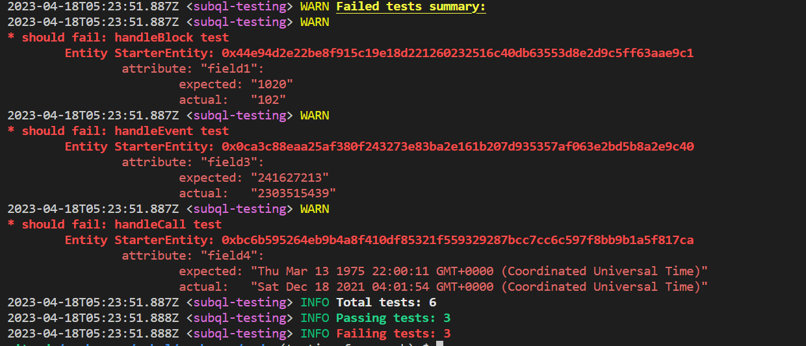

# Testing Framework

## Overview

This document outlines the testing framework used for Subquery projects. The testing framework provides an easy way to test the behavior of mapping handlers and validate the data being indexed.

## Usage

To use the testing framework, you need to:

1. Create test files with the naming convention *.test.ts and place them in the src/tests folder. Each test file should contain test cases for specific mapping handlers.
2. Run the testing service using the command: `subql-node test`.

## Writing Test Cases

Test cases should be written using the `subqlTest()` function with the following parameters:

- **name**: A string containing the name of the test.
- **blockHeight**: The height of the block used in the test.
- **dependentEntities**: An array of entities that are required for the test to run.
- **expectedEntities**: An array of entities that are expected after the mapping handler has run.
- **handler**: The name of the mapping handler function to test.

### Example test case

```javascript

// Example handleEvent function
/*
export async function handleEvent(event: SubstrateEvent): Promise<void> {
  const {
    event: {
      data: [account, balance],
    },
  } = event;
  //Retrieve the record by its ID
  const record = await StarterEntity.get(
    event.block.block.header.hash.toString()
  );
  record.field2 = account.toString();
  //Big integer type Balance of a transfer event
  record.field3 = (balance as Balance).toBigInt();
  await record.save();
}

*/

subqlTest(
    "handleEvent test", // test name
    1000003, // block height to process
    [
      StarterEntity.create({
        id: '0x0ca3c88eaa25af380f243273e83ba2e161b207d935357af063e2bd5b8a2e9c40', // Replace this with the actual block hash for block 103
        field1: 1000003,
      }),
    ], // dependent entities
    [
      StarterEntity.create({
        id: '0x0ca3c88eaa25af380f243273e83ba2e161b207d935357af063e2bd5b8a2e9c40', // Replace this with the actual block hash for block 103
        field1: 1000003,
        field2: '23M5ttkmR6KcoTAAE6gcmibnKFtVaTP5yxnY8HF1BmrJ2A1i', 
        field3: BigInt(2303515439), 
      }),
    ], // expected entities
    'handleEvent', //handler name
  );
```

## Running Tests

To run the tests, execute the subql-node test command. The testing service will discover and import test files, run the tests, and log the results.

Example output:

Passing test:


Failing test:


The output will include a summary of the total tests run, passing tests, and failing tests. If any tests fail, a detailed summary of the failed tests will be displayed:



## Example Project

An example Subquery project with test cases can be found in this repository: [acala-subql-tests](https://github.com/DeveloperInProgress/acala-subql-tests). This project demonstrates the usage of the testing framework and serves as a reference for developers who want to implement tests in their own Subquery projects.

The acala-starter project within the repository includes test files following the naming convention *.test.ts and are placed in the src/tests folder. These test files contain test cases for specific mapping handlers and showcase how to write and structure tests in a Subquery project.

To use the example project as a starting point for your project, you can either clone the repository or use it as a reference when implementing tests in your Subquery project. Make sure to follow the provided structure and adapt the test cases as needed to fit your project requirements.

## Running Tests with Docker

You can use Docker to run tests in an isolated environment.  Here is an example of subquery-node service in a docker-compose.yml file that runs your project using the Subquery node Docker image:

``` yml
subquery-node:
    image: onfinality/subql-node:latest
    depends_on:
      "postgres":
        condition: service_healthy
    restart: always
    environment:
      DB_USER: postgres
      DB_PASS: postgres
      DB_DATABASE: postgres
      DB_HOST: postgres
      DB_PORT: 5432
      RUN_TESTS: "false" # Set this to "true" to run tests
    volumes:
      - ./:/app
    command: >
      /bin/sh -c '
      CMD_OPTIONS="-f=/app --db-schema=app --disable-historical=false";
      if [ "$$RUN_TESTS" = "true" ]; then
        subql-node test $$CMD_OPTIONS;
      else
        subql-node $$CMD_OPTIONS;
      fi'
```

To run tests with Docker, set the RUN_TESTS environment variable to "true" in the docker-compose.yml file. Then, use the following command to start the Docker container:

```
docker-compose pull && docker-compose up
```

## Setting up GitHub Actions

GitHub Actions can be used to automate the testing process for your Subquery project. Here is an example workflow that runs tests whenever a new pull request is created:

```
name: PR
on:
  pull_request:
    paths-ignore:
      - ".github/workflows/**"
jobs:
  pr:
    name: pr
    runs-on: ubuntu-latest
    steps:
      - uses: actions/checkout@v2
      - name: Setup Node.js environment
        uses: actions/setup-node@v2
        with:
          node-version: 16
      - run: yarn
      - name: Codegen
        run: yarn codegen
      - name: Build
        run: yarn build
      - name: Install subql-node
        run: yarn global add @subql/node
      - name: Run tests with Subquery Node
        run: subql-node test -f ${{ github.workspace }}
```

This workflow checks out the repository, sets up a Node.js environment, installs the necessary dependencies, and runs the tests using the subql-node CLI.

To set up this GitHub Actions workflow, create a file named pr.yml (or any other name of your choice) inside the .github/workflows directory in your project and paste the above workflow configuration into the file. Once the file is saved, GitHub Actions will automatically start running the workflow whenever a new pull request is created.

## Framework Limitations and Inappropriate Use Cases

While the testing framework is a powerful tool for testing the behavior of mapping handlers and validating the data being indexed in Subquery projects, there are certain limitations and use cases that are not suitable for this framework.

### Limitations
- *Integration and end-to-end testing*: The testing framework is specifically designed for testing individual mapping handlers. It is not suitable for testing the integration of multiple components or the end-to-end functionality of your Subquery project.

- *State persistence*: The testing framework does not persist state between test cases. This means that any state changes made during a test case will not carry over to subsequent test cases. If your mapping handlers rely on previous state changes, the testing framework may not be suitable.

- *Dynamic data sources*: The testing framework cannot be used to test dynamic data sources. It is designed to test the behavior of mapping handlers and validate the data being indexed in Subquery projects, but it does not support testing the functionality related to dynamically adding or removing data sources during runtime.

### What You Should Not Use It For
- *Performance testing*: The testing framework is not designed to test the performance of your mapping handlers or the overall Subquery project. It focuses on the correctness of the data being indexed but does not measure the speed or efficiency of the data processing.

## Conclusion

The testing framework provides a convenient way to test mapping handlers and validate the data being indexed in Subquery projects. It ensures that the data processing logic works as expected and helps to catch errors early in the development process. By providing detailed summaries of failed tests, developers can quickly identify and resolve issues, improving the overall quality and reliability of the Subquery project.

