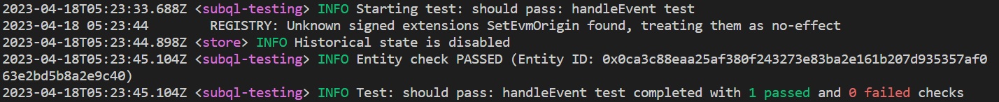
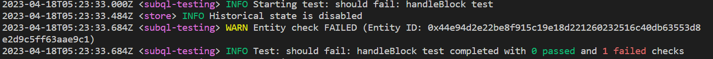
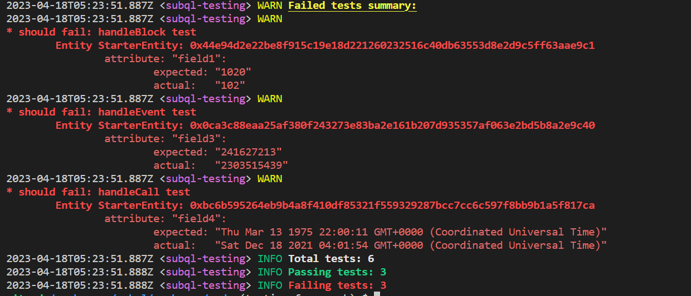

# Testing

## Overview

This document outlines the various testing approaches when building a SubQuery Project.

The SubQuery testing framework provides an easy way to test the behavior of mapping handlers and validate the data being indexed in an automated way.

## Manual Approaches

When developing your project, if you don't want to use the SubQuery Testing Framework, the following options or approaches can be used:

### Choosing the starting block

For the initial development of your project, if you're indexing a specific event, transaction, or log, update your `startBlock` in your `project.yaml` to the block number proceeding a known event, transaction, or log and then proceed indexing from there. This means you immediately receive data into your project for indexing and this can significantly shorten the development iteration time. This can be done on the [manifest file](./manifest), in the following section.

```yml
# ...
# {... Initial sections: spec-version, name, version, etc ...}
# ...
dataSources:
  - kind: ethereum/Runtime
    startBlock: 15695385
    options:
      abi: erc20
      address: "0xC02aaA39b223FE8D0A0e5C4F27eAD9083C756Cc2" # this is the contract address for wrapped ether https://etherscan.io/address/0xc02aaa39b223fe8d0a0e5c4f27ead9083c756cc2
    assets:
      erc20:
        file: "erc20.abi.json"
    mapping:
      file: "./dist/index.js"
      handlers:
        # {... handlers...}
```

### Logging

We recommend to generously use logging, including using the debug level when developing to reduce the number of logs printed in your production code. A good practice is to log a new event or transaction when you receive it in the mapping function so you know what error occurs where. When developing you can also debug the payload by stringfying it (note that `JSON.stringify` doesn’t support native `BigInts`).

The `console.log` method is **not supported**. Instead, a `logger` module has been injected in the types, which means we support a logger that can accept various logging levels.

```typescript
logger.info("Info level message");
logger.debug("Debugger level message");
logger.warn("Warning level message");
```

To use `logger.info` or `logger.warn`, just place the line into any mapping file. When developing a SubQuery project, it's common to log a message with the block height at the start of each mapping function so you can easily identify that the mapping function has been triggered and is executing. In addition, you can inspect the payload of data passed through to the mapping function easily by stringifying the payload. Note that `JSON.stringify` doesn’t support native `BigInts`.

```ts
export async function handleLog(log: EthereumLog): Promise<void> {
  logger.info('New log found at ' + log.blockNumber.toString());
  logger.info('New log payload ' + JSON.stringify(log.data));
  ... // do something
}
```

The default log level is `info` and above. To use `logger.debug`,you must add `--log-level=debug` to your command line.

If you are running a docker container, add this line to your `docker-compose.yaml` file.


You should now see the new logging in the terminal screen.


## The SubQuery Testing Framework

The testing framework provides a convenient way to test mapping handlers and validate the data being indexed in SubQuery projects. It ensures that the data processing logic works as expected and helps to catch errors early in the development process. By providing detailed summaries of failed tests, developers can quickly identify and resolve issues, improving the overall quality and reliability of the SubQuery project.

To use the SubQuery testing framework, you need to:

1. Create test files with the naming convention `*.test.ts` and place them in the `src/tests` folder. Each test file should contain test cases for specific mapping handlers.
2. Run the testing service using the command: `subql-node test`.

Each new starter project should have some default test boilerplate added so you can easily get started.

### Writing Test Cases

Test cases should be written using the `subqlTest(name, blockHeight, dependentEntities, expectedEntities, handler)` function with the following parameters:

- `name``: A string containing the name of the test.
- `blockHeight`: The height of the block used in the test.
- `dependentEntities`: An array of entities that are required for the test to run. When the test case is run, a new database store will be instantiated with this array of entities already saved.
- `expectedEntities`: An array of entities that are expected after the mapping handler has run. These are read from the store after the mapping function has finished. You can check for the presence of as many entities as you wish.
- `handler`: The name of the mapping handler function to test.

```ts
// Example handleEvent function
/*
export async function handleEvent(event: SubstrateEvent): Promise<void> {
  const {
    event: {
      data: [account, balance],
    },
  } = event;
  const record = await StarterEntity.get(event.block.block.header.hash.toString());
  record.field2 = account.toString();
  record.field3 = (balance as Balance).toBigInt();
  await record.save();
}

*/

subqlTest(
  "handleEvent test", // test name
  1000003, // block height to process
  [
    StarterEntity.create({
      id: "0x0ca3c88eaa25af380f243273e83ba2e161b207d935357af063e2bd5b8a2e9c40", // Replace this with the actual block hash for block 103
      field1: 1000003,
    }),
  ], // dependent entities
  [
    StarterEntity.create({
      id: "0x0ca3c88eaa25af380f243273e83ba2e161b207d935357af063e2bd5b8a2e9c40", // Replace this with the actual block hash for block 103
      field1: 1000003,
      field2: "23M5ttkmR6KcoTAAE6gcmibnKFtVaTP5yxnY8HF1BmrJ2A1i",
      field3: BigInt(2303515439),
    }),
  ], // expected entities
  "handleEvent" //handler name
);
```

### Running Tests

To run the tests, execute the `test` command (this assumes that you have `subql-node` installed). The testing service will discover and import test files, run the tests, and log the results.

::: code-tabs
@tab:active yarn

```shell
yarn test
```

@tab npm

```bash
npm run-script test
```

:::

An example of a passing test:



An example of a failing test:



The output will include a summary of the total tests run, passing tests, and failing tests. If any tests fail, a detailed summary of the failed tests will also be displayed:



### Example Project

An example SubQuery project with test cases can be found in this repository: [polkadot-starter](https://github.com/subquery/subql-starter/tree/main/Polkadot/Polkadot-starter). This project demonstrates the usage of the testing framework and serves as a reference for developers who want to implement tests in their own SubQuery projects.

The polkadot-starter project within the repository includes test files following the naming convention `*.test.ts` and are placed in the `src/tests` folder. These test files contain test cases for specific mapping handlers and showcase how to write and structure tests in a SubQuery project. You can also see the command for test in the `package.json` to show you how to execute the tests (requires `subql-node` to be installed):

To use the example project as a starting point for your project, you can either clone the repository or use it as a reference when implementing tests in your SubQuery project. Make sure to follow the provided structure and adapt the test cases as needed to fit your project requirements.

### Running Tests with Docker

You can use Docker to run tests in an isolated environment. Here is an example of subquery-node service in a `docker-compose.yml` file that runs your project using the SubQuery node Docker image:

```yml
subquery-node:
  image: onfinality/subql-node:latest
  depends_on:
    "postgres":
      condition: service_healthy
  restart: always
  environment:
    DB_USER: postgres
    DB_PASS: postgres
    DB_DATABASE: postgres
    DB_HOST: postgres
    DB_PORT: 5432
  volumes:
    - ./:/app
  command:
    - ${SUB_COMMAND} # set SUB_COMMAND env variable to "test" to run tests
    - -f=/app
    - --db-schema=app
  healthcheck:
    test: ["CMD", "curl", "-f", "http://subquery-node:3000/ready"]
    interval: 3s
    timeout: 5s
    retries: 10
```

To run tests with Docker, set the Docker SUB_COMMAND environment variable to "test" in the docker-compose.yml file. Then, use the following command to start the Docker container (tests will be run on startup automatically):

```
SUB_COMMAND=test docker-compose pull && docker-compose up
```

### Setting up GitHub Actions

GitHub Actions can be used to automate the testing process for your SubQuery project. Here is an [example workflow from the Polkadot Starter project](https://github.com/subquery/subql-starter/blob/main/Polkadot/Polkadot-starter/.github/workflows/pr.yml) that runs tests whenever a new pull request is created:

```yml
name: PR
on:
  pull_request:
    paths-ignore:
      - ".github/workflows/**"
jobs:
  pr:
    name: pr
    runs-on: ubuntu-latest
    steps:
      - uses: actions/checkout@v2
      - name: Setup Node.js environment
        uses: actions/setup-node@v2
        with:
          node-version: 16
      - run: yarn
      - name: Codegen
        run: yarn codegen
      - name: Build
        run: yarn build
      - name: Install subql-node
        run: yarn global add @subql/node
      - name: Run tests
        run: subql-node test -f ${{ github.workspace }}
```

This workflow checks out the repository, sets up a Node.js environment, installs the necessary dependencies, and runs the tests using the subql-node CLI.

Each [SubQuery starter project](https://github.com/subquery/subql-starter/blob/main/Polkadot/Polkadot-starter/.github/workflows/pr.yml) should have this GitHub action already added. To set up this GitHub Actions workflow on an old project, create a file named `pr.yml` (or any other name of your choice) inside the `.github/workflows` directory in your SubQuery project and paste the above workflow configuration into the file. Once the file is saved, GitHub Actions will automatically start running the workflow whenever a new pull request is created.

### When not to use the SubQuery Testing Framework

While the testing framework is a powerful tool for testing the behavior of mapping handlers and validating the data being indexed in SubQuery projects, there are certain limitations and use cases that are not suitable for this framework.

Limitations:

- Integration and end-to-end testing: The testing framework is specifically designed for testing individual mapping handlers. It is not suitable for testing the integration of multiple components or the end-to-end functionality of your SubQuery project.
- State persistence: The testing framework does not persist state between test cases. This means that any state changes made during a test case will not carry over to subsequent test cases. If your mapping handlers rely on previous state changes, the testing framework may not be suitable.
- Dynamic data sources: The testing framework cannot be used to test dynamic data sources. It is designed to test the behavior of mapping handlers and validate the data being indexed in SubQuery projects, but it does not support testing the functionality related to dynamically adding or removing data sources during runtime.

What You Should Not Use It For:

- Performance testing: The testing framework is not designed to test the performance of your mapping handlers or the overall SubQuery project. It focuses on the correctness of the data being indexed but does not measure the speed or efficiency of the data processing.
