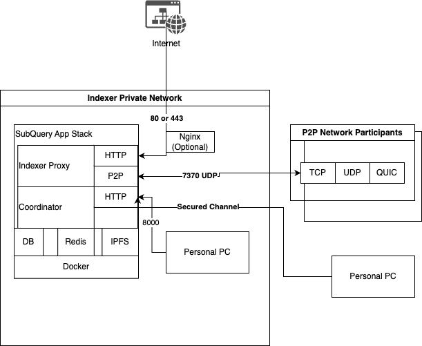

# Indexer Security Guide

## Background
Indexers serve as the backbone of the Subquery Network. They undertake the arduous task of running intensive indexing jobs and offer query services to the public. Ensuring the security of indexers is paramount, not only in the traditional infrastructure domain but also in the realm of cryptocurrency.

## Potential Risks
### Crypto-Related Concerns
* Loss of funds from the controller wallet.
* Unauthorized activities, misbehaviors of Subquery Network executed via the controller wallet.
* Phishing schemes targeting the indexer admin console, posing threats to the primary indexer wallet.

### Traditional Infrastructure Concerns
* System compromise, resulting in the machine being hijacked by malicious actors.
* Breaches within the private network.
* Risk of data corruption, physical hardware damage, and ransomware attacks.

## Architecture & Attack Vectors
The diagram below illustrates the topology of the Indexer's infrastructure. It's crucial to understand the architecture to identify potential security threats and vulnerabilities.

### 443 / 80
If nginx is used, consult the [official docs](https://docs.nginx.com/nginx/admin-guide/security-controls/)

### 8000
This port is designated for administrative purposes only and MUST NOT be exposed to the public.

Establish Firewall rules to safeguard the port. 
* If operating on public clouds, refer to the respective security group settings in their documentation.
* If running on bare metal and directly exposed to the internet, consider using tools like ufw/ufw-docker.
* If running from home, use router's settings and only open 433/80 via port forwarding.

### 7370
This port is generally safe.

### Docker
The Coordinator has unrestricted access to your host's Docker, which can pose security risks if not adequately shielded. If the machine is solely utilized for running Subquery services, indexers should contemplate applying specific Docker security measures. Refer to documentation on SeLinux or AppArmor for further insights.

## Other Best Practices
* Regularly update the host OS.
* Ensure the subquery service softwares are upgraded to the latest versions.

## Community Solutions
> Use on own risk
### Indexer Toolkit
https://github.com/web3cdnservices/subquery-indexer-toolkit
