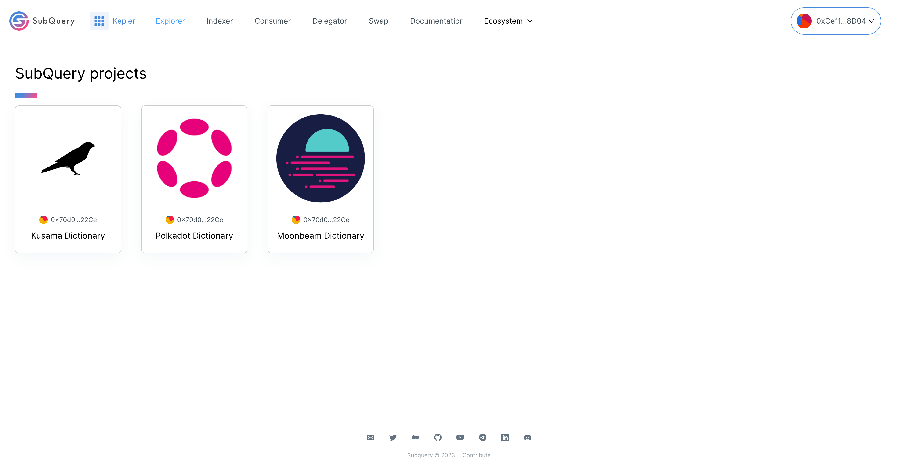
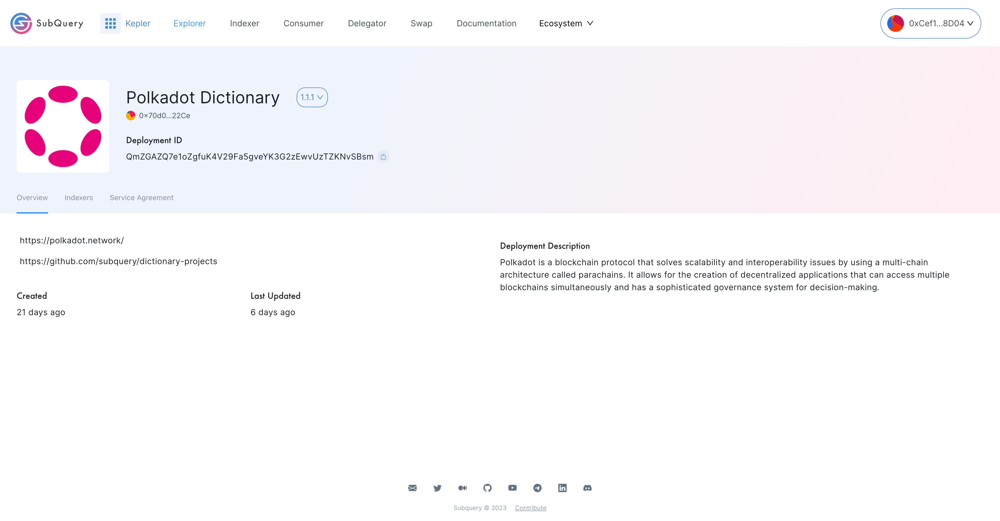
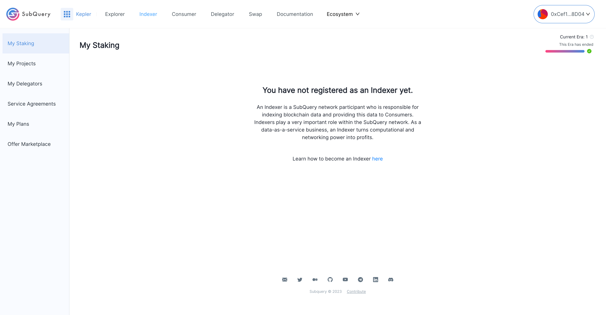
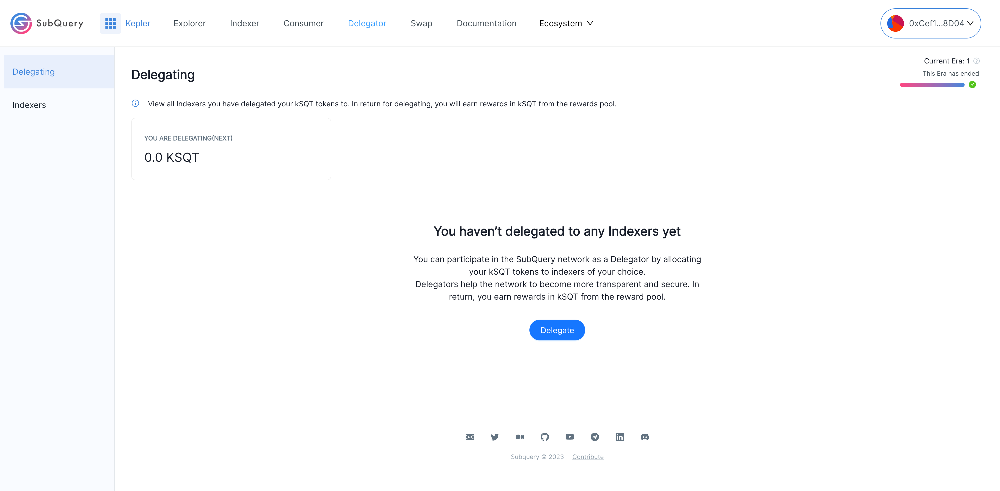
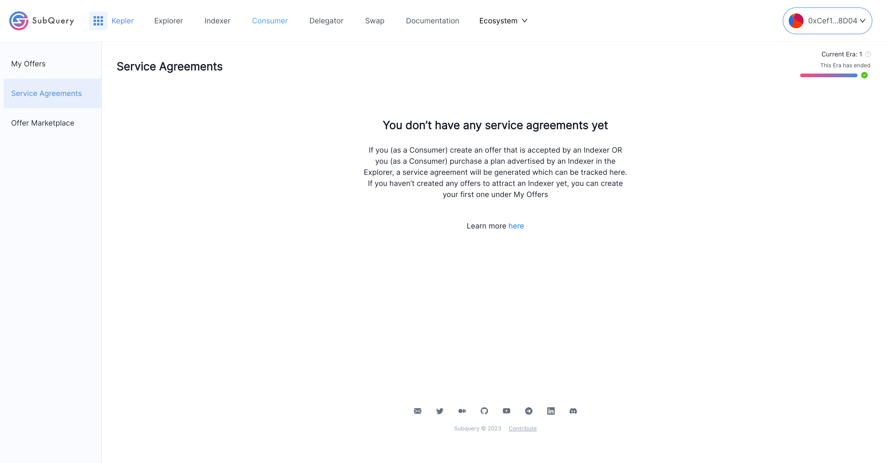
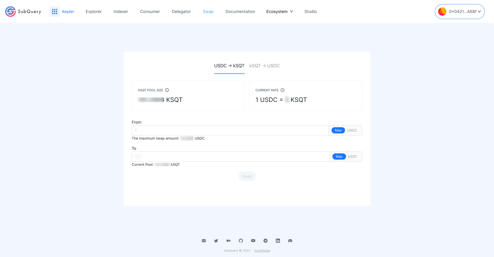

# Learn about how to use Kepler

## Kepler Dashboard

The Kepler dashboard is divided into several sections as can be seen below.

---

### Explorer

The explorer displays a list of all the projects that are being indexed. It’s also the place where consumers can select a particular project and purchase the associated plans. If no plans are listed, this indicates that an Indexer has not yet created a plan.

---

### Stake & Delegate:

This area:

- Allows Indexers and Delegators to manage their [stake](../../glossary/glossary.md#staking), [delegation](../../glossary/glossary.md#delegating), rewards, and view tokens that are [locked](../../glossary/glossary.md#lock-period).
- Allows Delegators to select Indexers and delegate their [SQT](../token.md).
- Allows Indexers to delegate to projects.

The Indexer Dashboard looks like below

The Delegator Dashboard looks like below

---

### Plans & Offers

This area:

- Lists [service agreements](../../glossary/glossary.md#service-agreements).
- Allows Indexers to create and manage their plans.
- Allows Consumers to create and manage their offers.
- Displays an offer marketplace where Indexers can accept an offer from Consumers.

---

### Swap

Swaps allows users to swap USDC to kSQT and vice versa.

---

### Governance

Participate in SubQuery's [governance process](https://snapshot.org/#/subquerynetwork.eth).

---

### Documentation

Learn more about the [SubQuery network](../introduction.html).

---

### Forum

Join the discussion in our [forum](https://forum.subquery.network/).
