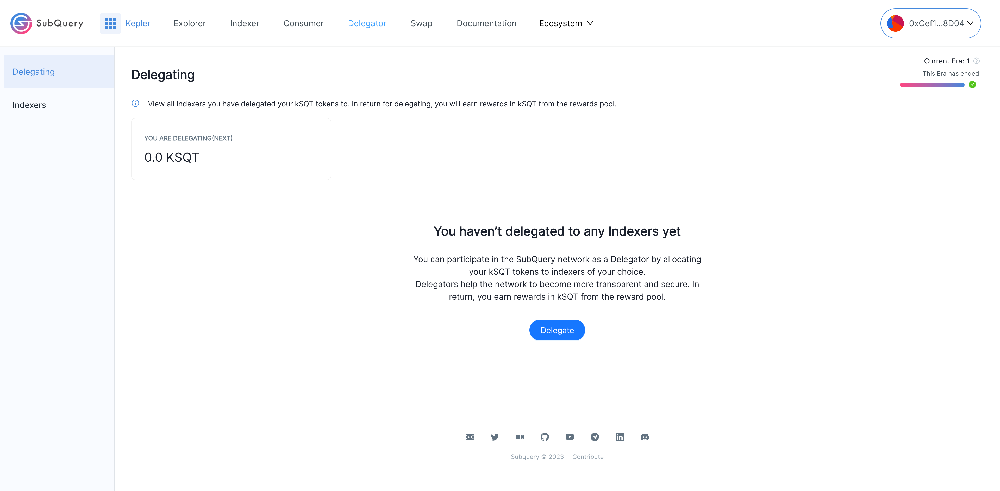
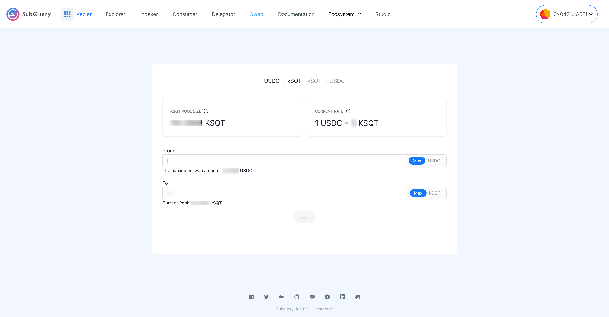

# Welcome to the Kepler Network

SubQuery’s mission is to help developers create the decentralised products of the future. In order to realise this, we are focused on the release of the [decentralised SubQuery Network](https://subquery.network/network). The final phase before launching the SubQuery Network is deploying the Kepler Network.

## What is the Kepler Network

The Kepler Network is the pre-mainnet of the SubQuery Network, and will enable users to progressively bootstrap and test the decentralised features of The SubQuery Network.

Kepler will run off the same smart contracts that our mainnet will do, the key difference is that certain features will be slowly enabled and brought online in a sustainable way.

The first users of the Kepler Network will be [Indexers](../indexers.md) (_Phase 1_) who will test their own technical expertise against their peers, whilst indexing real data that has been migrated from SubQuery’s existing Managed Service.

Over time we’ll introduce [Delegators](../delegators.md) (_phase 2_), followed by [Consumers](../consumers.md), who will be able to stake kSQT against their favourite indexers, receive rewards, and onboard other SubQuery projects into Kepler.

In return for being early adopters and providing value to existing SubQuery clients, Kepler participants will enjoy incentives via kSQT which will later be burnt in exchange for the SubQuery token (SQT) upon the mainnet launch later this year.

To summarise, the three main outcomes of Kepler are:

- Provide an environment for real indexers and delegators to onboard and earn real rewards.
- Seamlessly and progressively migrate real SubQuery project traffic from our Managed Service to the decentralised Kepler Network.
- Allow us to continue to fine-tune parameters of the network (including reward rates).

## Why Are We Launching Kepler?

You can think of Kepler as a pre-mainnet, a controlled phase that will help us bootstrap the mainnet with participants and activity.

In order to launch our decentralised network (The SubQuery Network), there are several technical milestones that must be met. The first significant milestone was achieved in 2022, with three successful ‘seasons’ (or phases) of our Frontier testnet which stress-tested the network in a test environment.

After taking these learnings, we elected to take a novel approach by allowing participants in our testnet to get started on real world projects now via Kepler rather than waiting for the launching of our token.

A further consideration is that when we survey the web3 ecosystem today, we see that many other projects that provide decentralised services have made poor progress migrating customers from their centralised services to their decentralised alternatives. Kepler is designed to migrate real projects from our managed service to the decentralised SubQuery Kepler Network in a carefully choreographed way whilst providing incentives to all.

The rationale is that we can demonstrate both the technical and commercial applications of the SubQuery Network and bootstrap the mainnet with participants and activity to accelerate our growth.

## Learn about how to use Kepler

### Kepler Dashboard

The Kepler dashboard is divided into several sections as can be seen below.

---

### Explorer

The explorer displays a list of all the projects that are being indexed. It’s also the place where consumers can select a particular project and purchase the associated plans. If no plans are listed, this indicates that an Indexer has not yet created a plan.

---

### Stake & Delegate:

This area:

- Allows Indexers and Delegators to manage their [stake](../../glossary/glossary.md#staking), [delegation](../../glossary/glossary.md#delegating), rewards, and view tokens that are [locked](../../glossary/glossary.md#lock-period).
- Allows Delegators to select Indexers and delegate their [SQT](../token.md).
- Allows Indexers to delegate to projects.

The Indexer Dashboard looks like below

The Delegator Dashboard looks like below

---

### Plans & Offers

This area:

- Lists [service agreements](../../glossary/glossary.md#service-agreements).
- Allows Indexers to create and manage their plans.
- Allows Consumers to create and manage their offers.
- Displays an offer marketplace where Indexers can accept an offer from Consumers.

---

### Swap

Swaps allows users to swap USDC to kSQT and vice versa.

---

### Governance

Participate in SubQuery's [governance process](https://snapshot.org/#/kepler.subquerynetwork.eth).

---

### Documentation

Learn more about the [SubQuery network](../introduction.html).

---

### Forum

Join the discussion in our [forum](https://forum.subquery.network/).
